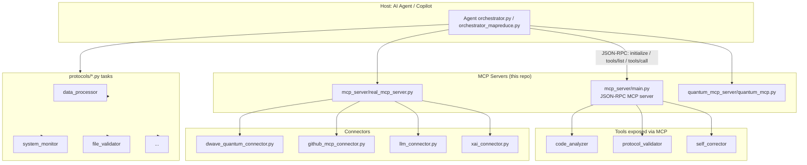

# Repo Map, Architecture & Agentic Workflow Checklist

This document maps `self-correcting-executor` for AI coding agents (Copilot
cloud agent, Copilot CLI, etc.) so an agent run can quickly orient itself
before making changes: what the repo does, how its pieces relate, what
already exists for MCP/agents/tools, and what to check before commit/merge.

## Repo tree (top level)

```
self-correcting-executor/
├── agents/            # A2A agent framework + MCP-enabled agents
├── analyzers/         # Static analysis helpers (pattern_detector, ...)
├── auth/              # Basic auth helpers
├── config/            # MCPConfig, component type definitions
├── connectors/        # MCP base + concrete connectors (D-Wave, GitHub, LLM, xAI)
├── docs/              # Architecture, planning & task docs (this file lives here)
├── fabric/            # Integrated MCP "fabric" / state continuity core
├── frontend/          # Vite/React UI
├── llm/               # Continuous learning system
├── mcp_runtime_template_hg/  # SDK/API/CLI template for MCP runtimes
├── mcp_server/         # Canonical JSON-RPC MCP server (main.py) + quantum tools
├── middleware/         # Security middleware
├── orchestrator.py, orchestrator_mapreduce.py  # Task orchestration entrypoints
├── protocols/          # Pluggable "protocol" tasks executed by the orchestrator
├── quantum_mcp_server/ # Quantum-specific MCP server variant
├── scripts/            # Compliance/setup/cleanup scripts
├── tests/ + test_*.py  # Pytest suites (see pytest.ini: testpaths = tests)
├── ui/                 # Additional UI assets/guide
└── utils/              # Shared logger/tracker/registry utilities
```

## Mermaid diagram: high-level architecture



## Checklist for an agent run in this repo

Use this before proving/implementing anything live in this repo:

- [x] **Agents** — `agents/a2a_framework.py`, `agents/a2a_mcp_integration.py`
      implement agent-to-agent (A2A) communication over MCP.
- [x] **Tools** — MCP tools are declared in `mcp_server/main.py`
      (`code_analyzer`, `protocol_validator`, `self_corrector`).
- [x] **MCP** — Baseline JSON-RPC server exists (`mcp_server/main.py`) and is
      verified live in `tests/test_mcp_baseline.py` (`initialize`,
      `tools/list`, `tools/call`, and error handling for unknown methods).
- [ ] **Pull / Push / Commit / Merge** — Use `engine-tools-report_progress`
      (or normal `git`/PR flow for humans); never push directly from an
      agent sandbox. See `CONTRIBUTING.md`.
- [ ] **Issues** — Track work items and link PRs with `Closes #<issue>`.
- [ ] **Code** — Run `python -m pytest tests/` (see `pytest.ini`) and the
      lint config in `.flake8` before committing.
- [ ] **Deps** — `requirements.txt` (runtime), `requirements-ci.txt` /
      `requirements-test.txt` (CI/tests), `frontend/package.json` (UI).
      Dependabot is configured in `.github/dependabot.yml`.
- [ ] **Database** — `protocols/database_health_check.py`,
      `utils/db_tracker.py` for DB-backed protocol tasks.
- [ ] **Actions** — `.github/workflows/python-ci.yml` and
      `.github/workflows/frontend-ci.yml` run CI on push/PR.
- [ ] **Role assignment** — `middleware/security_middleware.py`,
      `auth/basic_auth.py` for auth/authorization concerns.

## MCP capability negotiation baseline

Per the [MCP specification](https://modelcontextprotocol.io/specification/2026-07-28),
a host/server pair must be able to negotiate capabilities before any other
request. This repo's `mcp_server/main.py` implements the minimum required
surface:

| Method | Purpose |
| --- | --- |
| `initialize` | Returns `serverInfo` + `capabilities.tools` + `capabilities.resources` |
| `tools/list` | Lists available tools independently of `initialize` |
| `tools/call` | Executes a tool and returns real (non-mocked) results |
| `resources/list` / `resources/read` | Lists/reads MCP resources |
| `notifications/list` / `notifications/subscribe` | Baseline notification support |

This baseline is exercised live and asserted in
`tests/test_mcp_baseline.py`. Run it with:

```bash
python -m pytest tests/test_mcp_baseline.py -v
```

## Related repo-specific skills

Two agent skills tailored to this repo live under `.github/skills/`:

- `mcp-protocol-debugging` — how to exercise and debug the `mcp_server/main.py`
  JSON-RPC server directly (capability negotiation, tool calls, error cases).
- `quantum-connector-testing` — how to safely test `dwave_quantum_connector.py`
  without requiring a live D-Wave QPU token, consistent with this repo's
  "no mocks in production, real APIs only" convention (see
  `tests/test_mcp_compliance.py`).
