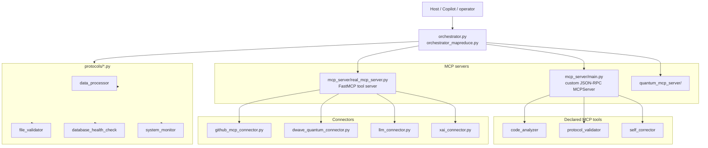

# Repo Map, MCP Verification, and Agent Workflow Checklist

This repository mixes agent orchestration, MCP servers, connectors, protocols,
and a small frontend. This document makes the issue's requested "repo assist"
material specific to `groupthinking/self-correcting-executor` so an agent can
map the repo, verify the MCP baseline live, and decide what to check before
commit/merge.

## Repo tree (focused map)

```text
self-correcting-executor/
├── agents/                  # A2A framework, executor, mutator, MCP integrations
│   ├── a2a_framework.py
│   ├── a2a_mcp_integration.py
│   ├── executor.py
│   ├── mutator.py
│   ├── specialized/
│   └── unified/
├── analyzers/               # Pattern analysis helpers
├── auth/                    # Auth helpers
├── config/                  # MCP and component configuration
├── connectors/              # D-Wave, GitHub, LLM, xAI, MCP base connectors
├── docs/                    # Architecture, planning, and task guides
├── fabric/                  # State continuity and integrated MCP fabric
├── frontend/                # Vite + React UI
├── llm/                     # Continuous learning system
├── mcp_runtime_template_hg/ # SDK/API/CLI MCP runtime template
├── mcp_server/              # JSON-RPC MCP server + FastMCP-backed server
├── middleware/              # Security middleware
├── protocols/               # Executable protocols/tasks
├── quantum_mcp_server/      # Quantum-focused MCP server variant
├── scripts/                 # Setup, compliance, cleanup, security scripts
├── test_data/               # Real input fixtures used by tests/scripts
├── tests/                   # Pytest suite
├── ui/                      # Additional UI assets and guide content
└── utils/                   # Shared logging and DB tracking
```

## Dependency snapshot

- Python runtime dependencies: `requirements.txt` currently pins **117**
  packages, including `mcp`, `mcp-use`, FastAPI, D-Wave Ocean SDK, LangChain,
  SQLAlchemy, Redis, and transformer-related packages.
- CI/test dependencies: `requirements-ci.txt` contains the lightweight
  verification stack (`black`, `flake8`, `pytest`, `pytest-cov`,
  `pytest-asyncio`).
- Frontend runtime dependencies: `frontend/package.json` currently declares
  **7** runtime packages (`react`, `react-dom`, `@tanstack/react-query`,
  `axios`, `framer-motion`, `lucide-react`, `three`) and **12** dev
  dependencies for TypeScript, ESLint, and Vite.

## Mermaid diagram



## Agentic workflow checklist for this repo

- [x] **Agents**: `agents/a2a_framework.py`, `agents/a2a_mcp_integration.py`,
      and `agents/unified/` contain agent coordination logic.
- [x] **Tools**: `mcp_server/main.py` declares `code_analyzer`,
      `protocol_validator`, and `self_corrector`.
- [x] **MCP**: the repo is actively using MCP packages and MCP-shaped servers
      (`mcp_server/main.py`, `mcp_server/real_mcp_server.py`,
      `config/mcp_config.py`, `connectors/mcp_base.py`).
- [x] **Pull / push / request / commit / merge**: human workflows use GitHub
      pull requests; cloud-agent workflows in this repo should publish progress
      via PR updates instead of pushing directly from the sandbox.
- [x] **Issues**: link changes back to GitHub issues with `Closes #<number>`.
- [x] **Code**: the main test entrypoint is `pytest` with `pytest.ini`
      configured to use `tests/`.
- [x] **Deps**: Python dependencies live in `requirements*.txt`; frontend
      dependencies live in `frontend/package.json`.
- [x] **Database**: DB-aware execution paths are visible in `utils/db_tracker.py`
      and `protocols/database_health_check.py`.
- [x] **Actions**: `.github/workflows/python-ci.yml` and
      `.github/workflows/frontend-ci.yml` define CI.
- [x] **Role assignment / security**: `auth/` and `middleware/` contain auth
      and security logic.

## MCP baseline: is this repo using MCP?

Yes. The repository is using MCP in two forms:

1. A custom JSON-RPC server in `/home/runner/work/self-correcting-executor/self-correcting-executor/mcp_server/main.py`
   with explicit MCP methods such as `initialize`, `tools/list`, `tools/call`,
   `resources/list`, and `resources/read`.
2. A FastMCP-based server in `/home/runner/work/self-correcting-executor/self-correcting-executor/mcp_server/real_mcp_server.py`
   built on the `mcp` package.

Compared with the MCP architecture/specification dated `2026-07-28`, this repo
already covers the **server** side baseline well enough to negotiate tools and
resources, but it does **not** implement a full host/client runtime in-repo.
That is acceptable for this codebase because GitHub Copilot/GitHub MCP acts as
the host environment around these servers.

### Host / client / server mapping for this repo

- **Host**: external agent host (for example Copilot, CLI, or another MCP-aware
  operator) orchestrates requests and permissions.
- **Client**: the MCP-aware caller is external to this repo; this repo does not
  ship a standalone client implementation.
- **Server**: this repo implements the server side in `mcp_server/` and
  `quantum_mcp_server/`.

## Live verification steps

The minimum capability-negotiation proof for this repo is to exercise the
custom MCP server directly and confirm that `initialize` advertises
capabilities, then `tools/list` and `tools/call` work end-to-end.

```bash
cd /home/runner/work/self-correcting-executor/self-correcting-executor
python - <<'PY'
import asyncio
import json
from mcp_server.main import MCPServer

async def main():
    server = MCPServer()
    for request in (
        {
            "jsonrpc": "2.0",
            "id": 1,
            "method": "initialize",
            "params": {"clientInfo": {"name": "repo-assist", "version": "1.0"}},
        },
        {"jsonrpc": "2.0", "id": 2, "method": "tools/list", "params": {}},
        {
            "jsonrpc": "2.0",
            "id": 3,
            "method": "tools/call",
            "params": {
                "name": "code_analyzer",
                "arguments": {"code": "def verify():\n    return 1\n"},
            },
        },
    ):
        print(json.dumps(await server.handle_request(request), indent=2))

asyncio.run(main())
PY
```

Focused automated verification for the repo-assist additions:

```bash
python -m pytest tests/test_repo_assist_docs.py -q
```

## CI baseline observed from GitHub Actions

- The repo has active `Python CI` and `Frontend CI` workflows.
- The inspected recent `Python CI` job logs showed `black` passing.
- The same logs also showed that `flake8` findings and `pytest` collection
  errors are currently masked by `|| echo ...` and `continue-on-error`, so the
  workflow can report success even when Python imports/tests are not clean.

## Skills added for this repo

Project-scoped skills now live under `.github/skills/`:

- `github-actions-failure-debugging`: tailored to the repo's Python/Frontend CI
  workflows and GitHub MCP debugging flow.
- `codebase-summary`: tailored to this repo's tree mapping, dependency checks,
  and MCP verification workflow.
